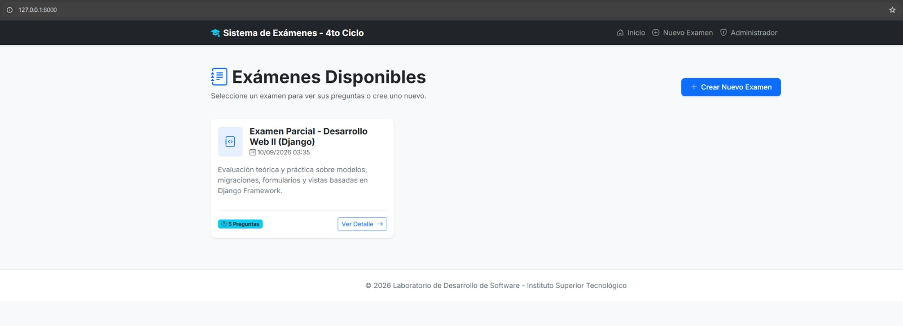
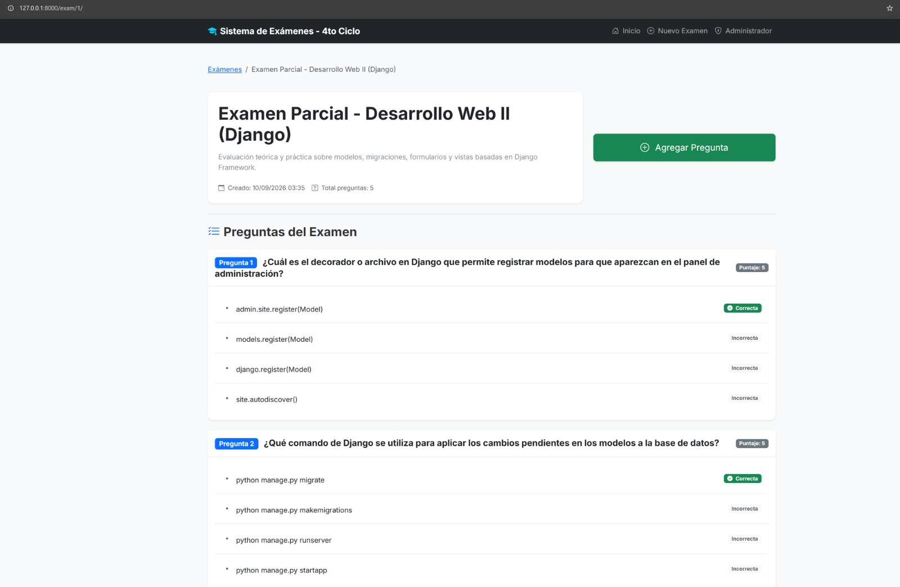
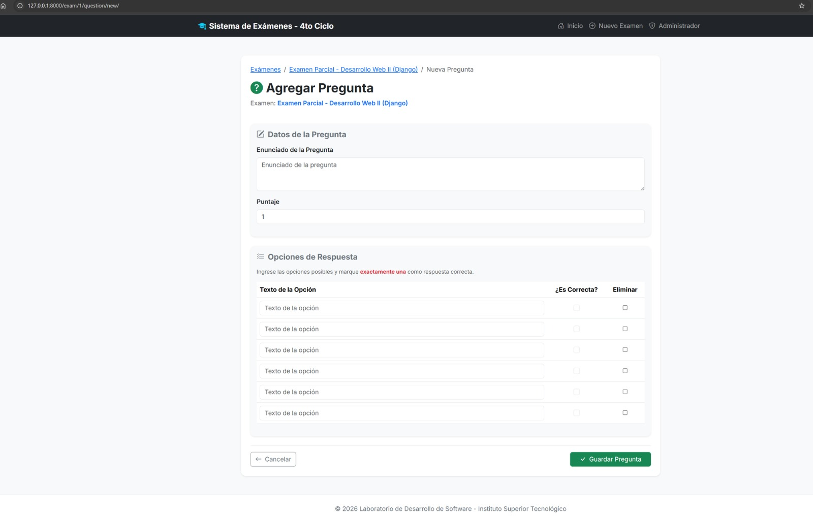
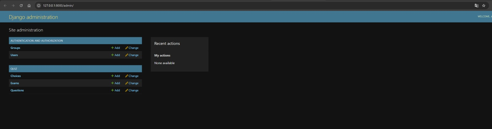

# 📚 Laboratorio 03: Sistema de Exámenes en Django (Quiz)

Plataforma web desarrollada en **Django y Bootstrap 5** orientada a la gestión y administración de exámenes y preguntas de opción múltiple. Este proyecto ha sido construido rigurosamente bajo los estándares de arquitectura de proyectos profesionales en Python (PEP 8), implementando modelos relacionales, formularios avanzados con formsets, migraciones versionadas y una interfaz moderna en español diseñada especialmente para el entorno académico.

---

## 👥 Integrantes del Equipo
* **Farid Chavez Campos** - Desarrollo Backend, Modelos y Base de Datos
* **Jordan Abad Mejia** - Desarrollo Frontend, Formularios y Vistas

---

## 🛠️ Tecnologías y Estándares Empleados
* **Python 3.14 / Django 6.1**: Arquitectura backend estructurada por responsabilidades (`src/`, `config/`, aplicación `quiz`), modelos en singular y `settings.py` seguro.
* **Bootstrap 5 & HTML5**: Interfaz visual atractiva, responsiva y en español, adaptada para estudiantes de 4to ciclo.
* **Git & GitHub**: Control de versiones riguroso mediante commits progresivos y estructurados en español.

---

## 📖 Descripción y Proceso de Desarrollo

El presente laboratorio se ha desarrollado aplicando una metodología de ingeniería de software estructurada, dividiendo el trabajo en fases progresivas que garantizan la mantenibilidad, escalabilidad y robustez de la aplicación web:

1. **Configuración Inicial del Entorno y Estructuración del Proyecto:**
   Se comenzó estableciendo un entorno virtual aislado (`.venv`) para la gestión limpia de dependencias. Se configuró la estructura de directorios recomendada para proyectos Django en producción, separando el código fuente en la carpeta `src/` y aislando la configuración global en el directorio `config/`. Asimismo, se generó el archivo de dependencias mediante `pip freeze > requirements.txt` para asegurar la reproducibilidad del entorno por parte de cualquier integrante del equipo, y se configuró el archivo `.gitignore` para omitir archivos temporales y bases de datos locales.

2. **Diseño y Declaración del Modelo de Datos Relacional:**
   Se creó la aplicación modular `quiz` e incluyó en las `INSTALLED_APPS`. A continuación, se diseñaron tres entidades principales con sus respectivas clases `Meta` (definiendo ordenamientos por defecto y nombres legibles en singular y plural):
   - **`Exam`**: Contiene atributos para el título, descripción detallada y fecha de creación (`auto_now_add`).
   - **`Question`**: Relacionada con `Exam` mediante una llave foránea (`ForeignKey` con eliminación en cascada), almacena el enunciado de la pregunta, el puntaje ponderado y una pista opcional añadida en fases posteriores de refactorización.
   - **`Choice`**: Asociada a `Question`, almacena el texto descriptivo de la alternativa de respuesta y un indicador booleano (`is_correct`) para determinar si es la respuesta válida.

3. **Gestión de Migraciones Versionadas e Integridad de Base de Datos:**
   Tras la declaración de los modelos, se procedió a generar y auditar el archivo de migración inicial (`0001_initial.py`). Una vez revisadas las operaciones de creación de tablas, se aplicó `migrate` sobre el motor SQLite. Posteriormente, al añadir un nuevo campo (`hint`) al modelo `Question`, se generó la segunda migración (`0002_question_hint.py`), comprobando el correcto versionado del esquema de la base de datos sin pérdida de información y verificando la existencia de las tablas mediante inspección directa.

4. **Desarrollo de Formularios Avanzados y Validación de Formsets:**
   Para la interacción con el usuario, se implementaron `ModelForms` personalizados con estilos adaptados a Bootstrap 5. El mayor desafío técnico se resolvió en la creación de preguntas, donde se implementó un `inlineformset_factory` de Django. Este componente permite administrar simultáneamente la pregunta junto a sus múltiples opciones de respuesta en una sola interfaz tabular. Además, se programó una **validación de negocio estricta** en la vista correspondiente para asegurar que, al enviar el formulario, **exactamente una única opción** quede marcada como correcta, previniendo errores lógicos en las evaluaciones.

5. **Implementación de Vistas, Enrutamiento y Experiencia de Usuario (UX):**
   Se escribieron las vistas basadas en funciones para el listado general de exámenes, la vista de detalle (que despliega el examen junto a sus preguntas estructuradas y alternativas) y el formulario de alta con su respectivo formset. Las rutas (`urls.py`) se estructuraron jerárquicamente tanto a nivel de proyecto como de la aplicación. Visualmente, se diseñó un sistema de plantillas HTML reutilizables (heredando de un `base.html` central) utilizando Bootstrap 5, iconos dinámicos y alertas de notificaciones, logrando una interfaz sumamente atractiva, limpia y completamente en español apta para estudiantes.

6. **Administración y Control de Versiones Progresivo:**
   Se registraron los tres modelos en el panel de administración de Django (`admin.py`) utilizando `TabularInline` y `StackedInline` para agilizar la carga anidada de preguntas y opciones. Finalmente, todo el historial de desarrollo se subió al repositorio remoto de GitHub mediante múltiples commits progresivos y profesionales en español, cumpliendo estrictamente con los requerimientos pedagógicos del curso.

---
## 📸 Evidencias del Desarrollo

### 1. Vista Principal (Listado de Exámenes)


### 2. Detalle del Examen (Preguntas y Opciones Correctas)


### 3. Formulario de Creación de Preguntas (Formset)


### 4. Panel de Administración de Django


## 🌐 Rutas y Enlaces de la Aplicación (Localhost)

Una vez iniciado el servidor con `python manage.py runserver`, puedes acceder a las siguientes rutas:

* **Página Principal (Listado de Exámenes):**
  [http://127.0.0.1:8000/](http://127.0.0.1:8000/)

* **Crear Nuevo Examen:**
  [http://127.0.0.1:8000/exam/new/](http://127.0.0.1:8000/exam/new/)

* **Detalle del Examen (Preguntas y Opciones):**
  [http://127.0.0.1:8000/exam/1/](http://127.0.0.1:8000/exam/1/)

* **Agregar Pregunta con Formset de Opciones:**
  [http://127.0.0.1:8000/exam/1/question/new/](http://127.0.0.1:8000/exam/1/question/new/)

* **Panel de Administración de Django:**
  [http://127.0.0.1:8000/admin/](http://127.0.0.1:8000/admin/)

## 📂 Estructura del Proyecto

```text
Lab03v2/
├── .venv/                      # Entorno virtual de Python
├── requirements.txt            # Dependencias generadas con pip freeze
├── .gitignore                  # Archivos excluidos del control de versiones
└── src/
    ├── manage.py               # Utilidad de línea de comandos de Django
    ├── config/                 # Configuración principal del proyecto
    │   ├── settings.py         # Configuración y variables de entorno
    │   └── urls.py             # Enrutamiento global
    └── quiz/                   # Aplicación principal del laboratorio
        ├── admin.py            # Registro de modelos en el panel de administración
        ├── forms.py            # Formularios y formsets validados
        ├── models.py           # Modelos relacionales (Exam, Question, Choice)
        ├── views.py            # Vistas de listado, detalle y creación
        ├── urls.py             # Rutas de la aplicación
        ├── migrations/         # Migraciones versionadas (0001 y 0002)
        └── templates/quiz/     # Plantillas HTML responsivas (Bootstrap 5)
